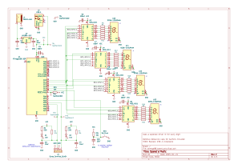
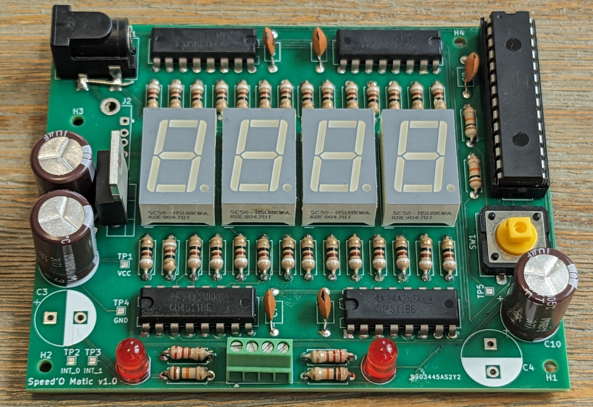
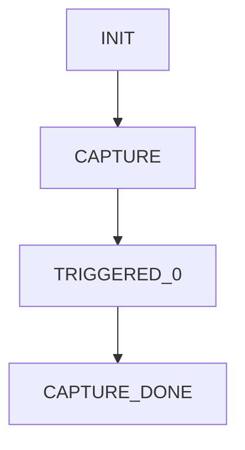

# Speed'o'Matic

A small hardware/software project to build a velocity sensor for my [potato cannon](https://en.wikipedia.org/wiki/Potato_cannon).  
Using two strips of tinfoil stretched across a pipe, which are torn by the passing projectile, this system measures the travel time and calculates the velocity of the potato. Results are shown on a set of ultra-bright 7-segment displays.

## Overview

The goal of this project is to measure the velocity of a potato accelerated inside a PVC tube. The design uses a simple two-barrier timing system where the time difference between two breakpoints is used to estimate the projectile's average velocity.

To make the system detachable and reliable, a separate piece of pipe (matching the barrel diameter) is used. Two thin strips of aluminum foil are stretched across this pipe at fixed distances—these act as breakable electrical contacts. When the projectile passes through, it breaks the foils, triggering the timing logic.

The circuit is built around an ATMega microcontroller that measures and displays the travel time and optionally computes the velocity. The following sections describe the circuit and software in more detail.

## Hardware

The ATMega microcontroller handles all logic and is powered via a simple linear regulator. With the currently used LM1084 regulator, the input voltage can range from 5V to 29V.

In addition to measuring time, the microcontroller also drives four 7-segment displays to show timing and status information. To ensure maximum brightness (important for outdoor use), the displays are not multiplexed. Each display is driven by its own MOS4511 driver IC. Combined with 91Ω segment resistors, this setup results in an extremely bright, easily readable output - even in direct sunlight.

An extra push-button is included for to reset the software after a completed measurment.

The schematic above shows the complete circuit design.

Below is an image of the assembled PCB.  
The unpopulated capacitor footprints in the foreground were included for optional input debouncing, in case the mechanical barrier setup introduced signal glitches. In practice, these capacitors were not necessary, but the footprints remain available for future use.

Also note the empty space in the top-left corner, which was intended for a USB-A receptacle. See the [To-Do / Known Issues](#to-do--known-issues) section for more information.

## Software

The microcontroller is programmed via the Arduino platform and [MiniCore](https://github.com/MCUdude/MiniCore) board support package. The core logic is implemented as a state machine in `lichtschranke.ino`, with board-specific port definitions in separate header files.

### State Descriptions

- **`INIT`**
  - Entered on boot or when the reset button is pressed.
  - Displays the status of the two barriers (0/1) to indicate whether they are intact.
  - Transitions to `CAPTURE` once both barriers remain intact for 1 second.

- **`CAPTURE`**
  - Waits for the first foil to break (first interrupt).
  - Displays all zeros.
  - Transitions to `TRIGGERED_0` if the first barrier is broken.

- **`TRIGGERED_0`**
  - Waits for the second foil to break.
  - Displays the elapsed time since the first barrier was broken.
  - Transitions to `CAPTURE_DONE` once the second barrier is triggered.

- **`CAPTURE_DONE`**
  - Indicates successful capture; both barriers have been broken in the correct order.
  - Displays the time delta in milliseconds.
  - Returns to `INIT` when the reset button is pressed.

- **`GENERAL_ERROR`**
  - Currently unused; reserved for future error handling scenarios.

## To-Do / Known Issues

### Interrupt Pins

The barrier sensors are currently routed to general-purpose pins, requiring the use of pin-change interrupts instead of dedicated external interrupts. While functional, this requires additional code to determine which pin triggered the interrupt and its edge direction. Future versions should re-route these signals to the ATMega's external interrupt pins for cleaner and more efficient interrupt service routines.

### USB-A Connector

The board currently includes a footprint for a USB-A connector, originally intended as an alternate power source. However, USB-A is poorly suited for this purpose. Consider replacing it with a USB micro-B or USB-C connector, or removing it altogether in future revisions.

### LED Brightness

The displays may actually be *too* bright for some conditions. In future revisions, consider using higher-value segment resistors to reduce brightness and power consumption, especially for indoor or low-light use.
